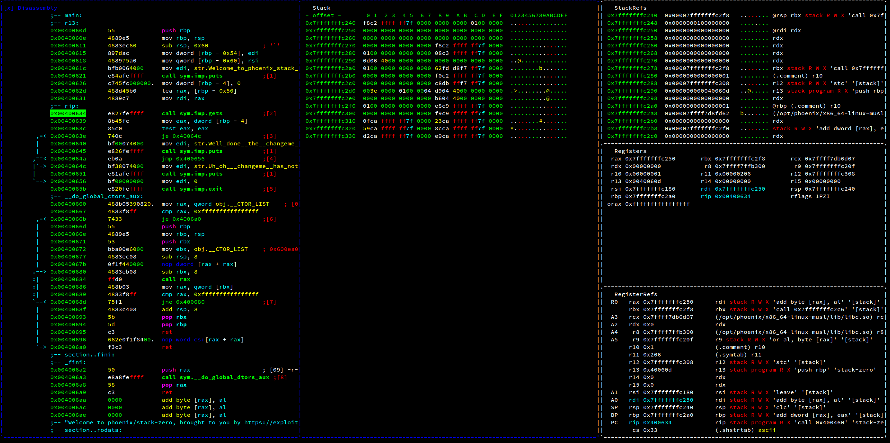
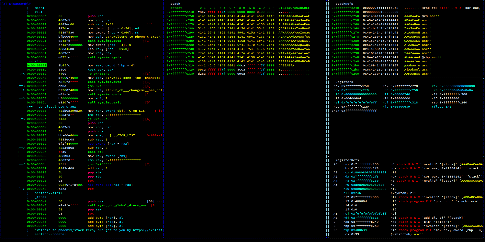

# Solution to Stack-Zero

## Ragg2 For pattern creation

Create a random pattern file using the **De Bruijn Sequence** and save it to a file

```
λ ragg2 -P 200 -r >> pattern.txt
```

## Set up R2 Profile

Create a file called `profile.rr2` that will store our profile configurations.

```
#!/usr/bin/rarun2
stdin=./pattern.txt
```

## Radare2 Analyze

Let's first anaylize the binary 

```
arch     x86            (1)
baddr    0x400000
binsz    6087
bintype  elf
bits     64
canary   false          (2)
sanitiz  false
class    ELF64
crypto   false
endian   little
havecode true
intrp    /opt/phoenix/x86_64-linux-musl/lib/ld-musl-x86_64.so.1
laddr    0x0
lang     c
linenum  true
lsyms    true
machine  AMD x86-64 architecture
maxopsz  16
minopsz  1               
nx       false          (3)
os       linux
pcalign  0
pic      false          (4)
relocs   true
relro    partial        
rpath    /opt/phoenix/x86_64-linux-musl/lib
static   false
stripped false
subsys   linux
va       true


```

- [1]: The arch let's us know which architecture this binary belongs to, in this case it is a intel x86 instruction set 64bit architecture.

- [2]: The canary protection  named for their analogy to a canary in a coal mine, are used to detect a stack buffer overflow before execution of malicious code can occur. This method works by placing a small integer, the value of which is randomly chosen at program start, in memory just before the stack return pointer. Most buffer overflows overwrite memory from lower to higher memory addresses, so in order to overwrite the return pointer (and thus take control of the process) the canary value must also be overwritten. This value is checked to make sure it has not changed before a routine uses the return pointer on the stack.[2] This technique can greatly increase the difficulty of exploiting a stack buffer overflow because it forces the attacker to gain control of the instruction pointer by some non-traditional means such as corrupting other important variables on the stack.

- [3]: The nx flag let us known if the stack is executable, if this value is set to false, then it means that code can be executed from the stack, most of the time this value is enabled to prevent code execution from the stack.

- [4]: The pic flag stands for Position Independent Code and it tell us if the code will be placed at random locations in memory if the value is true.


### Run the program 

Executing the program in debug mode with radare

```
λ r2 -r profile.rr2 -d ../../stack-zero
```

- **-d**: debug mode.
- **-r**: specify rarun2 profile to load 

Once the binary has been loaded we analyze for symbols, functions etc.

```
[0x7ffff7dc5d34]> aas

```

Now that the binary has been analyzed we can execute commands while referencing the symbols instead of the hexadecimal address numbers.

```
[0x7ffff7dc5d34]> dcu?
Usage: dcu   Continue until address
| dcu.             Alias for dcu $$ (continue until current address
| dcu address      Continue until address
| dcu [..tail]     Continue until the range
| dcu [from] [to]  Continue until the range

[0x7ffff7dc5d34]> dcu main
Continue until 0x0040060d using 1 bpsize
hit breakpoint at: 40060d

```

- **dcu**: **d**ebug **c**ontinue **u**ntil.

This command will execute the code until it hits the main function, leaving us in the begging of the code instructions.

### Solution
Visual mode gives you a block view of the code, this is helpful to view all the branching paths the execution could take. Pressing **VV** while seeking to the main function, this will output the following 

This shows a block of normal execution with a branching path, depending if true or false then joins back to exit.
The code that makes the decision is
```
test eax, eax 
je 0x40064c
```
The `test eax,eax` instructions basically means that if eax is zero then do something since test is esentially mapped to a binary AND bit operation. There are two scenarios that can make the variable take different paths `eax = 0 ` and `eax != 0`.

If `eax = 0011`

| 0 | 0 | 1 | 1 |
|---|---|---|---|
| 0 | 0 | 1 | 1 |
| - | - | - | - |
| 0 | 0 | 1 | 1 |

If `eax = 0000`


| 0 | 0 | 0 | 0 |
|---|---|---|---|
| 0 | 0 | 0 | 0 |
| - | - | - | - |
| 0 | 0 | 0 | 0 |

This means that `test eax eax` will result in 0 if `eax = 0` and set the `ZF` flag (Zero Flag) and if `eax != 0` then `test eax eax` will not set the `ZF` flag and thus the conditions for branching have been discovered.

So lets take a look at what sets `eax` and figure out how to manipulate it.
```
call sym.imp.gets
mov eax, dword [local_4h]
```
So these instructions manipulate the data that is stored in `eax`, the `imp.gets` allows the user to input data, and that data is stored in `eax`

## Stack

Lets view the stack and figure out what is there and how to modify the contents before and after executing the gets instruction:

- Before:





